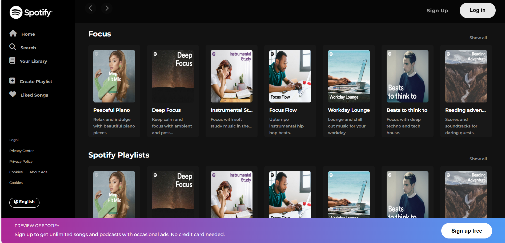

# Spotify Clone - Music Player

A responsive web-based music player inspired by Spotify, built using **HTML** and **CSS**.  
It features a modern UI with playlists, album covers, and a fixed preview bar.

## Features
- Responsive sidebar navigation
- Playlists with album images and descriptions
- Hoverable play buttons
- Fixed preview bar with sign-up CTA
- Footer with company, community, and social links

## Screenshots

*This is the actual screenshot from the project.*

## Technologies Used
- HTML
- CSS
- Font Awesome icons

